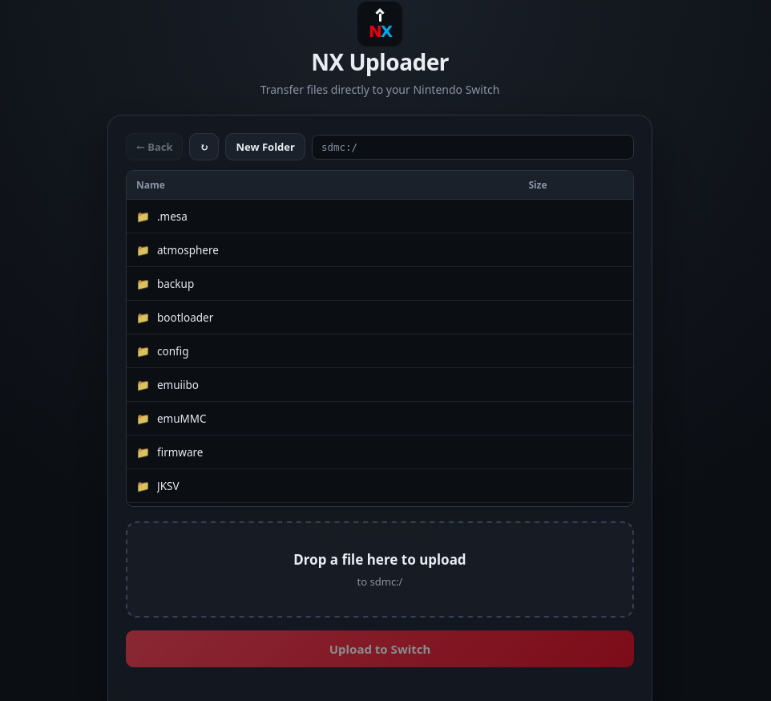

# NX Uploader

A minimal HTTP file manager and uploader server for the Nintendo Switch. 
Runs in homebrew mode, serves a web page on your LAN, and lets any browser 
on the same network drop files straight onto the SD card. No client software, 
no FTP,no jank (it's VERY janky, LOL).

## Why

My Switch is docked almost all the time. I also emulate a lot on the switch, so
there's a constant trickle of ROMs, saves, texture packs, mods, and
random `.nro`s that need to end up on the SD card. The usual options all
sucked in the same way:

- **Pull the SD card**, eject, find a reader, copy, put it back, wait
  for the console to boot. Five minutes of friction for a
  five-second file transfer.
- **Plug in a USB cable**, no.
- **FTP**, the server on the Switch is slow, drops connections on
  large files, and wants a dedicated client open on the other end. I
  don't want a client, I want a browser tab.
- **Nintendo's official transfer**, LOL.

The Switch is already on my LAN. It's already running homebrew. Both of
those things are true any time I want to move a file onto it. So the
whole job should be "drag file into browser tab" and nothing else.

So I built that. NX Uploader is ~1000 lines of C and ~700 of HTML/CSS/JS,
speaks HTTP/1.1, and streams uploads straight to disk instead of
buffering in RAM, so multi-gigabyte files work fine.

Also, honestly: why not.




## Features

- File manager to browse the sdcard, create folders, rename or move
  entries, and delete files or whole folders
- Drag-and-drop uploads from any modern browser
- Queued multi file uploads
- Folder upload: drop or pick a directory tree, and subfolders are created
  on the fly
- Optional "upload to sdmc:/switch instead" toggle, a one-tap shortcut for
  dropping a `.nro` where hbmenu will find it
- File downloads from switch to client.
- Streaming multipart parser, no whole-file buffering, works with files
  larger than the Switch's RAM
- Live progress bar in the browser, live bytes-received counter and
  transfer speed on the Switch screen
- Free-space readout on the Switch screen and in the browser, with an
  early refusal when an upload will not fit
- Overwrite prompt in the browser before an existing name is replaced
- Cancel button that actually stops the upload and deletes the partial file
- Optional config file for port, sandbox root, read-only mode, and
  HTTP Basic auth
- No dependencies beyond libnx
- Single `.nro`, ~300 KB
- Web UI is a single `web/index.html` embedded into the binary at build
  time — edit the HTML, run `make`, no C required

## Requirements

- A Nintendo Switch with homebrew access (Atmosphere, etc.)
- Wi-Fi or Ethernet connection on the same LAN as your browser machine

## Usage

1. Copy `NXUploader.nro` to `sdmc:/switch/` on your SD card.
2. Launch it from hbmenu.
3. The console shows a URL like `http://192.168.1.10:8080`. Open it in
   any browser on the same network.
4. Drag a file onto the page, click Upload.
5. Files land in the folder the file manager is showing (the SD card root
   by default).

Press **+** on the Switch to stop the server and exit.

The upload limit is 32 GiB per file. That's arbitrary and can be raised
in `src/server.c` (`MAX_UPLOAD_BYTES`) if you have a reason to.

## Configuration

Everything works with no config file. To change the defaults, drop a file
at `sdmc:/switch/nxuploader.cfg`. Every key is optional, lines are
`key=value`, and `#` starts a comment.

```ini
port=8080                         # base port, fallbacks try 8081..8083
root=sdmc:/                       # sandbox base for browse, delete, mkdir, rename
upload_dir=sdmc:/switch/uploads   # used only when a request has no
                                  # X-Upload-Dir header (scripts, not the browser)
read_only=0                       # 1 disables uploads, delete, mkdir, and rename
allow_delete=1                    # 0 disables delete and rename
auth_user=                        # set both auth_user and auth_pass to
auth_pass=                        # require HTTP Basic auth (the browser prompts)
log=0                             # 1 appends each request to
                                  # sdmc:/switch/nxuploader.log
```

With a narrower `root`, the file manager cannot see or touch anything
outside it.

## Building

Requires devkitPro with the `switch-dev` group installed. If you just
want to run it, grab a release `.nro` and skip this section.

```sh
git clone https://github.com/samedog/NX-Uploader
cd NX-Uploader
make
```

The host-side unit tests cover the multipart parser, the file manager, and
the config parser. They build with your normal system compiler, so no
devkit setup is needed to run them:

```sh
make test
```

## How it works

- `src/main.c`: applet loop, console rendering, entry point
- `src/server.c`: socket setup, HTTP parsing, `GET` and `POST`
- `src/multipart.c`: streaming multipart parser with a 256-byte lookback
  so boundaries straddling chunk edges aren't missed
- `src/fileman.c`: sandboxed browse, list, delete, mkdir, and rename
- `src/storage.c`: SD free and total space
- `src/config.c`: optional config file loader
- `src/net_info.c`: local IP detection
- `web/index.html`: the browser UI, embedded at build time
- `Makefile`: generates `src/html_data.c` from `web/index.html`
- `tests/`: host-side unit tests for the parser, file manager, and config
- `.github/workflows/build.yml`: CI that builds the `.nro` and, on a tag,
  attaches it to a release

Uploads are written to disk as bytes arrive off the socket. If the
connection drops before the closing boundary, the partial file is
deleted. The whole upload is never held in RAM.

## TODO:

- HTTP keep-alive, so the file manager does not open a new TCP connection
  for every listing
- Per-file progress in the upload queue
- Sort and filter in the file manager

## License

MIT — see [LICENSE](LICENSE).